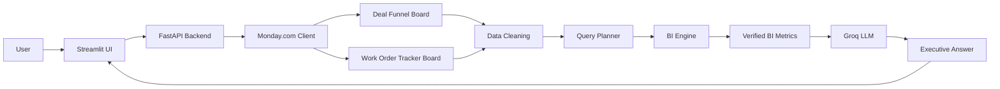

The issue is a syntax error in your **Mermaid diagram block** under the ## 🏗️ Architecture section. You have plain text (Architecture Flow1. User -> Stre) placed directly inside the ```mermaid code block, which breaks GitHub's rendering.
The polished, production-ready README.md with the fixed syntax is provided below. You can copy and paste this directly into your file.
```markdown
# 🚀 Founder BI Agent — Monday.com Integration

> **Ask business questions in plain English. Get executive-ready insights from live Monday.com data.**

## 🎯 What is this?

**Founder BI Agent** is a Business Intelligence agent that connects to live **Monday.com** boards and converts natural-language business questions into verified, data-driven answers.

It combines:
- 🧠 LLM-powered query understanding
- 📊 Deterministic BI calculations
- 🔗 Monday.com GraphQL API
- 💬 Streamlit chat interface
- ⚡ FastAPI backend
- 🛡️ Data-quality and missing-value handling

---

## ✨ Core Capabilities

| Capability | Description |
|---|---|
| 🔗 Live Monday.com Data | Fetches current data directly from Monday.com |
| 📈 Pipeline Intelligence | Analyzes deal pipeline and deal values |
| 💰 Financial Intelligence | Calculates contracted, billed, collected, and outstanding amounts |
| 🏗️ Work Order Intelligence | Analyzes work-order execution status |
| 🧠 Natural Language | Ask questions without writing SQL or Python |
| 🎯 Sector Filtering | Dynamically identifies and filters by sector |
| 💬 Follow-up Questions | Maintains lightweight conversation context |
| 🛡️ Verified Metrics | Business calculations are performed deterministically |
| ⚠️ Data Quality | Explicitly surfaces missing or unavailable data |
| 🤖 LLM Explanation | Converts verified metrics into concise executive answers |

---

## 🏗️ Architecture


### Architecture Flow
 1. **User → Streamlit**: The user asks a business question through the Streamlit chat interface.
 2. **Streamlit → FastAPI**: The frontend sends the question to the FastAPI backend.
 3. **FastAPI → Monday.com**: The backend fetches live data from the Deal Funnel and Work Order Tracker boards.
 4. **Data Cleaning**: Raw Monday.com data is cleaned and normalized before analysis.
 5. **Query Planner**: The LLM identifies the user's intent, relevant sector, and required board(s).
 6. **BI Engine**: The BI Engine performs deterministic business calculations using Pandas.
 7. **Verified Metrics → LLM**: Only the calculated and verified metrics are passed to the LLM.
 8. **Executive Answer**: The LLM converts the verified metrics into a concise, business-focused response.
## 🔄 How It Works
<details>
<summary><b>1️⃣ Ask a business question</b></summary>
The user enters a natural-language question through the Streamlit interface.
> *Example: How is our pipeline looking for Renewable Energy?*
> </details>
> 
<details>
<summary><b>2️⃣ Fetch live Monday.com data</b></summary>
The FastAPI backend connects to Monday.com through the GraphQL API and retrieves the required board data.
</details>
<details>
<summary><b>3️⃣ Clean and normalize the data</b></summary>
The raw board data is cleaned before analysis. This includes handling:
 * Text fields
 * Numeric values
 * Monetary values
 * Dates
 * Missing values
 * Sector names
   </details>
<details>
<summary><b>4️⃣ Understand the question</b></summary>
The Query Planner uses the LLM to identify:
 * User intent
 * Relevant sector
 * Relevant board(s)
 * Whether clarification is required
   </details>
<details>
<summary><b>5️⃣ Calculate verified metrics</b></summary>
The BI Engine performs deterministic calculations using Pandas. The LLM does not calculate the business metrics directly.
</details>
<details>
<summary><b>6️⃣ Generate the answer</b></summary>
The verified metrics are passed to the LLM, which generates a concise executive-style response.
The system instructs the LLM to:
 * Never invent numbers
 * Use only verified metrics
 * Distinguish missing data from zero
 * Mention relevant data-quality caveats
   </details>
## 📊 Supported Business Questions
**📈 Pipeline**
 * How is our pipeline looking?
 * What is the pipeline value for Renewable Energy?
 * How many deals have we won?
 * How many deals have been lost?
**💰 Financial**
 * How much have we billed?
 * How much have we collected?
 * What is the outstanding billed amount?
 * What percentage of the contracted value has been billed?
**🏗️ Work Orders**
 * How many work orders do we have?
 * What is the execution status?
 * How much value has been contracted?
 * What is the collection percentage?
**💬 Follow-up Questions**
The application maintains lightweight session context so users can ask follow-up questions.
 * *User:* How is our pipeline for Renewable Energy?
 * *Agent:* [Pipeline summary for Renewable Energy...]
 * *User:* How many of those deals are won?
 * *Agent:* [Won deals count for Renewable Energy...]
## 🧠 Design Philosophy
### LLM for Understanding — Code for Truth
```text
Natural Language → LLM → Query Plan → Deterministic BI → Verified Metrics → LLM → Executive Answer

```
 * The **LLM** is responsible for understanding intent and writing executive explanations.
 * The **BI Layer (Pandas)** is responsible for performing deterministic calculations.
 * This design eliminates financial hallucination risks.
## 🛡️ Data Quality
The system explicitly handles incomplete data:
 * **Missing values vs. Zero:** 5 out of 42 missing deal values are reported as explicit missing-data caveats rather than falsely treated as ₹0.
 * **Safe Division:** Percentages are guarded against zero-division (e.g., if denominator = 0, returns None instead of throwing an error or reporting 0%).
## 🗂️ Project Structure
```text
monday-bi-agent/
│
├── app.py
├── streamlit_app.py
│
├── Monday_client.py
├── cleaner.py
├── bi_engine.py
├── query_planner.py
│
├── requirements.txt
├── README.md
├── .gitignore
│
└── .env

```
> 🔐 .env is used for local development and should never be committed to GitHub.
> 
## 🔑 Environment Variables
Create a .env file in the root directory:
```env
MONDAY_API_KEY=your_monday_api_key
DEALS_BOARD_ID=your_deals_board_id
WORK_ORDERS_BOARD_ID=your_work_orders_board_id
GROQ_API_KEY=your_groq_api_key

```
## ⚙️ Local Setup
**1. Clone the repository**
```bash
git clone https://github.com/codehacker4655/monday-bi-agent.git
cd monday-bi-agent

```
**2. Create and activate a virtual environment**
 * macOS/Linux:
   ```bash
   python3 -m venv venv
   source venv/bin/activate
   
   ```
 * Windows:
   ```cmd
   python -m venv venv
   venv\Scripts\activate
   
   ```
**3. Install dependencies**
```bash
pip install -r requirements.txt

```
**4. Start the FastAPI backend**
```bash
uvicorn app:app --reload

```
**5. Start the Streamlit frontend**
```bash
streamlit run streamlit_app.py

```
## 🌐 Deployment
The application can be deployed using cloud platforms like Render or Railway.
 * **Frontend:** Streamlit App
 * **Backend:** FastAPI Server
 * **Integrations:** Monday.com GraphQL API, Groq LLM API
## 🧪 Example Interaction
**👤 User:**
> How is our pipeline looking for Renewable Energy?
> 
**🤖 Founder BI Agent:**
> **Pipeline Analysis for Renewable Energy:**
>  * **Total Deals:** 12
>  * **Pipeline Value:** ₹4,50,00,000
>  * **Won Deals:** 4
>  * **Lost Deals:** 2
> ⚠️ **Data Quality Note:** 1 deal in this sector has a missing deal value.
> 
## 🧰 Technology Stack
| Technology | Purpose |
|---|---|
| 🐍 Python | Core programming language |
| ⚡ FastAPI | Backend API engine |
| 💬 Streamlit | Interactive user interface |
| 📊 Pandas | Deterministic BI & data calculations |
| 🔗 Monday.com GraphQL API | Live data fetching |
| 🤖 Groq | High-speed LLM inference |
| 🦜 LangChain | LLM orchestration |
| ☁️ Render | Cloud deployment hosting |
## 🔐 Security Notes
 * API keys must be kept private inside environment variables.
 * Ensure .env is listed in .gitignore.
 * Production credentials should be configured safely via your hosting provider's dashboard secrets.
## 🎯 Key Engineering Decisions
<details>
<summary><b>Why not let the LLM calculate metrics directly?</b></summary>
LLMs are strong at intent recognition and context summarization, but prone to mathematical hallucinations. Code-based processing using Pandas ensures 100% deterministic, accurate financial metrics.
</details>
<details>
<summary><b>Why dynamically discover sectors?</b></summary>
Dynamic sector discovery reads values straight from Monday.com boards instead of using static hard-coded arrays. This allows the system to seamlessly adapt as new sectors are added to boards.
</details>
<details>
<summary><b>Why track missing values explicitly?</b></summary>
Treating missing financial entries as zero skews real business averages and totals. Expressing missing entries explicitly as data caveats gives leadership true confidence in data accuracy.
</details>
## 🚀 Future Improvements
 * 📅 Advanced date-range filtering (e.g., Q3 performance, MoM growth)
 * 📊 Interactive visualizations and executive charts
 * 📈 Predictive revenue forecasting models
 * 💾 Persistent cross-session user memory
 * 🧪 Comprehensive automated unit testing suite
## 👨‍💻 Project Details
**Founder BI Agent — Monday.com Integration**
*Built as a full-stack AI + Business Intelligence solution combining live data APIs, deterministic analytics, and conversational intelligence.*
⭐ **If you find this project useful, feel free to give it a star!**
```

```
