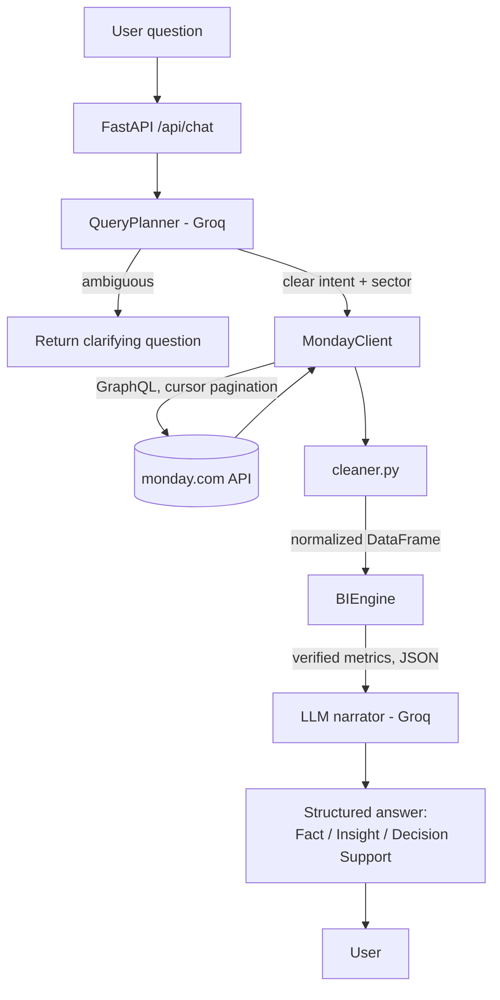

# monday-bi-agent

> A conversational BI agent that answers founder-level business questions by querying **live data from monday.com** — no hardcoded CSVs, no stale snapshots.

[](https://www.python.org/)
[](https://fastapi.tiangolo.com/)
[](https://groq.com/)
[]()

Built for the Skylark Drones Full-Stack Assignment.

---

## Table of Contents

- [What this does](#what-this-does)
- [Live Demo](#live-demo)
- [Architecture](#architecture)
- [The Data](#the-data)
- [Setup](#setup)
- [monday.com Board Setup (important)](#mondaycom-board-setup-important)
- [API Usage](#api-usage)
- [Example Queries](#example-queries)
- [Data Quality Handling](#data-quality-handling)
- [Tech Stack](#tech-stack)
- [Project Structure](#project-structure)
- [Known Limitations](#known-limitations)
- [Roadmap](#roadmap)
- [License](#license)

---

## What this does

Founders don't want to click through boards to find answers — they want to ask *"how's the Mining sector doing"* and get a real answer. This agent:

- Connects live to two monday.com boards (**Deals** and **Work Orders**) via the GraphQL API
- Cleans messy real-world data on every fetch (nulls, inconsistent naming, embedded junk rows)
- Interprets loose, founder-style natural-language questions
- Asks a clarifying question when a query is genuinely ambiguous, instead of guessing
- Computes verified metrics in code (never lets the LLM invent numbers) and then narrates them with context and caveats

<details>
<summary><strong>Why "live data" matters (click to expand)</strong></summary>

The brief explicitly requires querying monday.com dynamically rather than working off a static export. This means:
- Board edits (renamed columns, deleted items, status changes) are reflected on the very next query
- No sync/ETL step to keep in sync
- The trade-off: every query pays the cost of a fresh API fetch — see [Known Limitations](#known-limitations)

</details>

---

## Live Demo

🔗 **[TODO: paste hosted prototype URL here]**

No local setup required to try it — see the [Example Queries](#example-queries) section for what to ask.

---

## Architecture



**Design principle: separation of computation and narration.** `BIEngine` computes every number in plain pandas — sums, percentages, groupings — and returns structured JSON. The LLM's job is *only* to explain that JSON in natural language, under a system prompt that explicitly forbids inventing figures or assuming relationships (like deal→work-order mapping) that aren't in the data. This is the single biggest anti-hallucination decision in the project — see the [Decision Log](./DECISION_LOG.md) for why.

---

## The Data

Two monday.com boards, seeded from the provided Excel files:

<details open>
<summary><strong>📋 Deals board</strong> (from <code>Deal_funnel_Data.xlsx</code>)</summary>

| Column | Type | Notes |
|---|---|---|
| Item (Deal name) | Text | Masked/codenamed |
| Deal Status | Status | Won / Dead / Open / On Hold |
| Owner code | Text | `OWNER_00X` |
| Client Code | Text | `COMPANYXXX` |
| Sector/service | Status/Dropdown | 11 valid sectors |
| Closure Probability | Number | |
| Masked Deal value | Number | ~52% of rows have this missing |
| Deal Stage | Status | Funnel stage, e.g. "B. Sales Qualified Leads" → "H. Work Order Received" |
| Created Date | Date | |
| Tentative Close Date | Date | |
| Close Date (A) | Date | Mostly empty — most deals still open |

**344 clean rows** after removing 2 embedded duplicate-header rows (a raw-data artifact, not real deals).

</details>

<details>
<summary><strong>🛠️ Work Orders board</strong> (from <code>Work_Order_Tracker_Data.xlsx</code>)</summary>

| Column | Type | Notes |
|---|---|---|
| Item (Deal name masked) | Text | |
| Customer Name Code | Text | `WOCOMPANY_00X` |
| Sector | Status/Dropdown | 6 of the 11 sectors appear here |
| Nature/Type of Work | Text | |
| Execution Status | Status | Ongoing / Completed / Not Started / etc. |
| Amount in Rupees (Contracted) | Number | Masked |
| Billed Value in Rupees | Number | Masked |
| Collected Amount in Rupees | Number | Masked |
| WO / Invoice / Collection / Billing Status | Status | Several parallel status fields |
| Date of PO/LOI, Data Delivery Date, Collection Date | Date | Frequently empty |

**176 rows.**

</details>

---

## Setup

```bash
git clone https://github.com/codehacker4655/monday-bi-agent.git
cd monday-bi-agent
pip install -r requirements.txt
```

Create a `.env` file:

```env
MONDAY_API_KEY=your_monday_api_token
GROQ_API_KEY=your_groq_api_key
DEALS_BOARD_ID=your_deals_board_id
WORK_ORDERS_BOARD_ID=your_work_orders_board_id
```

Run it:

```bash
uvicorn main:app --reload --port 8000
```

<details>
<summary>Where to find your monday.com API key and board IDs</summary>

- **API key:** monday.com → Avatar (bottom left) → Developers → My Access Tokens
- **Board ID:** open the board → it's the number in the URL, `https://<your-org>.monday.com/boards/<BOARD_ID>`

</details>

---

## monday.com Board Setup (important)

⚠️ **Column titles matter.** This agent matches monday.com column titles against expected names (e.g. `"Deal Status"`, `"Execution Status"`). When importing the provided Excel files, **monday.com's import wizard can silently rename columns to generic defaults** (`Status`, `Date`) if you don't confirm names explicitly at the mapping step.

**Steps:**

1. Create a new board for each Excel file, using monday's "Import from Excel" option.
2. During the column-mapping step, **verify every column title matches the source spreadsheet exactly** — don't accept generic defaults.
3. After import, spot-check for **duplicate header rows** (rows where a status column literally contains the text `"Deal Status"` or `"Execution Status"` instead of a real value) and **stray placeholder items** monday sometimes seeds new boards with. Delete these.
4. Confirm your item counts: **344** on the Deals board, **176** on the Work Orders board.

See [`DECISION_LOG.md`](./DECISION_LOG.md) for the full story of how this was diagnosed — it's a good example of the data-resilience problem the assignment is testing for.

---

## API Usage

```bash
curl -X POST http://localhost:8000/api/chat \
  -H "Content-Type: application/json" \
  -d '{
    "message": "How is the Mining sector performing?",
    "session_id": "demo-session-1"
  }'
```

<details>
<summary>Example response shape</summary>

```json
{
  "response": "**Fact**\n- Mining has 106 deals in the pipeline...\n\n**Insight**\n...\n\n**Decision Support**\n...",
  "clarification_needed": false,
  "session_id": "demo-session-1"
}
```

</details>

`session_id` lets the agent maintain conversational context (e.g. resolving "what about last quarter" as a follow-up) — see [Known Limitations](#known-limitations) for how this is currently stored.

---

## Example Queries

<details open>
<summary><strong>Try these</strong></summary>

- "How many deals have we won?"
- "What's our collection percentage?"
- "Which sector has the largest outstanding billed value?"
- "What's the pipeline value for Mining?"
- "What sectors have work orders but aren't in the pipeline?"
- "What's the execution status of work orders for Powerline?"
- "What's the pipeline value for Aerospace?" *(tests graceful handling of an invalid sector)*

</details>

---

## Data Quality Handling

The source data is intentionally messy. Rather than fail or silently guess, the agent is designed to surface data-quality issues to the user as part of its answer.

<details>
<summary><strong>Missing values</strong></summary>

~52% of deals have no recorded value. Any pipeline-value answer explicitly states how many deals were excluded from the sum, so a founder never mistakes "the visible total" for "the true total."
</details>

<details>
<summary><strong>Inconsistent status text (casing/whitespace)</strong></summary>

Status fields are normalized (trimmed, case-folded) before grouping, so `"Won"`, `"won "`, and `"WON"` are treated as the same bucket instead of silently fragmenting counts.
</details>

<details>
<summary><strong>Embedded duplicate header rows</strong></summary>

Two rows in the raw Deals data contain the literal text `"Deal Status"` where a real status value should be — a spreadsheet artifact. These are detected and dropped during cleaning rather than counted as deals with an unknown status.
</details>

<details>
<summary><strong>Sector validation</strong></summary>

Sector names typed by the user are checked against the live, dynamically-fetched list of sectors actually present in the data (not a hardcoded list) — an invalid sector (e.g. "Aerospace") gets a clarifying response listing the real options, instead of a false zero.
</details>

<details>
<summary><strong>Cross-board caution</strong></summary>

Deals and Work Orders are **separate boards with no explicit linking field**. The agent never assumes a 1:1 correspondence between a deal and a work order — cross-board answers (e.g. "which sectors have deals but no work orders") are computed by comparing sector sets, not by inferring conversion rates that the data doesn't actually support.
</details>

---

## Tech Stack

| Layer | Choice | Why |
|---|---|---|
| Backend | FastAPI | Async, fast to iterate on in a 6-hour window |
| Data source | monday.com GraphQL API | Live data, per assignment requirement |
| LLM (planning) | Groq — `[TODO: model name]` | Fast inference for query intent extraction |
| LLM (narration) | Groq — `gpt-oss-120b` | Turns verified metrics into founder-readable prose |
| Data processing | pandas | Cleaning + aggregation |
| Hosting | `[TODO: e.g. Render / Railway / Fly.io]` | |

---

## Project Structure

```
monday-bi-agent/
├── main.py            # FastAPI app, /api/chat route, conversation context
├── Monday_client.py    # GraphQL client, cursor-paginated board fetch
├── cleaner.py          # Data cleaning: dedup, normalization, type coercion
├── bi_engine.py         # Verified metric computation (pipeline, execution, cross-board)
├── query_planner.py     # Intent extraction + clarification detection (Groq)
├── requirements.txt
└── .env.example
```

---

## Known Limitations

- **Conversation memory is in-process** (`conversation_contexts: Dict`) — resets on redeploy or restart; not shared across multiple server instances.
- **No persistent caching** of board data — every query re-fetches live from monday.com, which is correct per the brief but adds latency on large boards.
- **No auth layer** on the API itself — fine for a take-home demo, not production-ready.
- **Deals ↔ Work Orders have no explicit link field** in the source data, so any "conversion rate" style question is answered at the sector level, not the individual-deal level.

---

## Roadmap


- [ ] Persist conversation context (Redis or similar) instead of in-memory dict
- [ ] Cache board fetches with a short TTL to reduce latency without sacrificing "live" freshness
- [ ] Add automated regression tests for the verification checklist in the Decision Log

---

## License

`[TODO: add a license, or note "Submitted as an assignment deliverable — not for redistribution"]`
